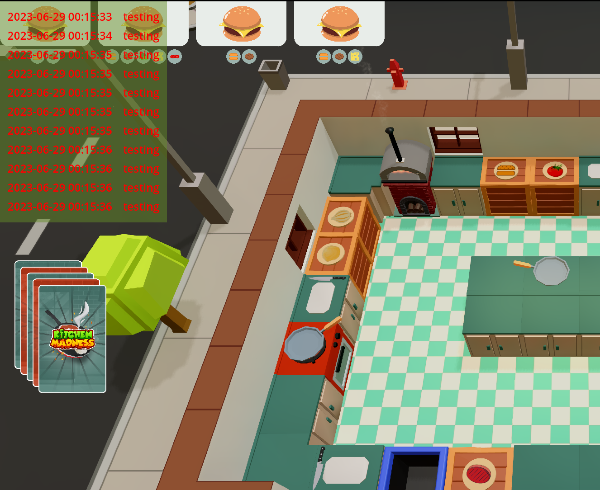
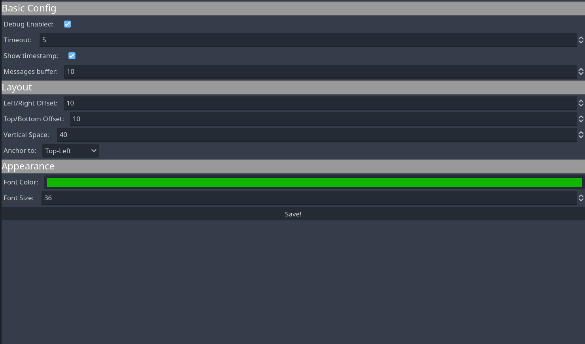

# Screen Console Logging Tool for Godot

Screen Console is a logging tool made for Godot 4 that allows you to print messages to the screen for debugging and development purposes.

It was developed as part of the development of the Kitchen Madness game, but I decided to make the tool open source since I believe that other may have the same issue.



## Requirements:

* Godot 4.0 +

## How to Setup?

1. Create the `addons/` folder if you do not already have one.
2. Clone or copy the Screen Console project folder to the `addons/` folder.
3. Open `Project Settings` and go to the `Plugins` Tab.
4. Enable the `Screen Console` plugin by clicking the checkbox.
5. Go to the `Autoload` Tab
7. Click the button to set the path navigate to `addons/screen_console/screen_console.gd`.
8. Set the `Node Name` to `SConsole` and click `Add`

Done!

## Properties



### Debug Enabled
Enables/Disable logging with the Screen Console tool. This makes it so you don't really have to delete or comment it out the `SConsole.print()` in your code.

If disabled than nothing will be printed.

### Messages Buffer:
Number of maximum number of messages printed to the screen at one time. 

If it goes over that, print commands will be ignores until messages on screen are lower than buffer again.

### Timeout:
Time messages will stay on screen in seconds.

After that messages will be automatically deleted.

### Show Timestamp
If enabled a current timestamp will appear next to the log message.

### Vertical Space:
Vertical spacing between messages. Bigger fonts may need bigger vertical spacing.

### Font Color:
Well, pretty self explanatory.

### Background Color:
Color for the background layer. So it is easier to see the logs on screen.

### Font Size:
Well, pretty self explanatory.

### Anchor (Disabled until I fix a bug):
Where on the screen you would like the messages to be anchored to.

* Top-Left
* Top-Right
* Bottom-Left
* Bottom-Right


## How to use it?

To print messages to screen all you need to do is:
```gdscript
SConsole.print("Hello Screen Console!)
```

That is all!

### Project Progress (and feature list)
*Not checked means I am currently working on.*

- [x] Be able to print messages to screen on top left corner
- [x] Create scene to be able to visualy configure tool
- [x] Remove messages from screen after a timeout
- [x] Show timestamp on message (optional)
- [x] Configure spacing from corners
- [x] COnfigure vertical spacing between messages
- [x] Be able to anchor messages to corners other than Top Left.
- [x] Be able to configure font color.
- [x] Be able to configure font size.
- [x] Be able to enale and disable logging messages to screen with checkbox.
- [x] Add layer as a background of messages

### Roadmap
Features that are in the roadmap of the project:

*Ideally in order of priority, but nothing set in stone.*

- [ ] Fix Anchor bug
- [ ] Add custom formatting of messages
- [ ] Add options to save logging to disc

### Contributing
**Pull requests are warmly welcome!!!**

For major changes, please [open an issue](https://github.com/joaoh82/screen_console/issues/new) first and let's talk about it. We are all ears!

If you'd like to contribute, please fork the repository and make changes as you'd like and shoot a Pull Request our way!

**Please make sure to update tests as appropriate.**

If you feel like you need it go check the GitHub documentation on [creating a pull request](https://help.github.com/en/github/collaborating-with-issues-and-pull-requests/creating-a-pull-request).

### Code of Conduct

Contribution to the project is organized under the terms of the
Contributor Covenant, the maintainer of Screen Console, [@joaoh82](https://github.com/joaoh82), promises to
intervene to uphold that code of conduct.

### Contact

If you want to contact me you can reach me at <joaoh82@gmail.com>.